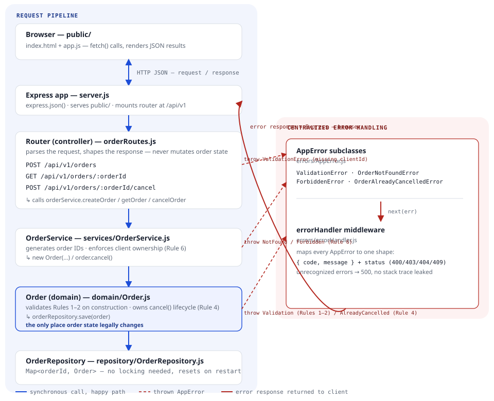
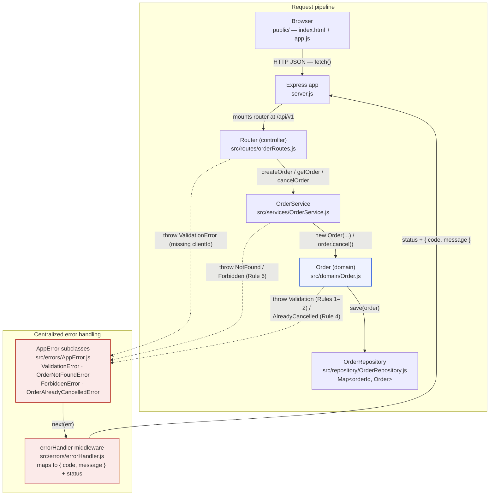

# Equity Order Management Service — Architecture

A layered REST service: every request is parsed by a thin controller,
routed through a service that enforces client ownership, validated and
mutated by an `Order` domain object that owns its own lifecycle, and
persisted to an in-memory map. Any rule violation is funneled to one
centralized error handler instead of being checked ad hoc at each layer.

## Request flow and error handling

The same diagram as an editable Mermaid flowchart (renders on GitHub/GitLab/VS Code if the image above doesn't load in your viewer):

Solid arrows trace the happy path: browser → Express → router → service →
domain → repository, one function call per hop. Dashed arrows show where
each of the three inner layers throws a typed `AppError`; every one is
caught by the single Express error-handling middleware, which is the only
place that writes an error response.

## Walking a request: cancel an order

1. `app.js` sends `POST /api/v1/orders/ORD-10001/cancel?clientId=CLIENT001`.
2. Express matches the route and hands off to the router; no body parsing
   is needed for this call.
3. The router reads `clientId` from the query string and calls
   `orderService.cancelOrder(orderId, clientId)` — it does not touch the
   order itself.
4. `OrderService` looks the order up by ID. Not found → throws
   `OrderNotFoundError`. Found but owned by another client → throws
   `ForbiddenError` (Rule 6).
5. Ownership checks out, so the service calls `order.cancel()` on the
   domain object. If the order is already `CANCELLED`, the *domain object
   itself* throws `OrderAlreadyCancelledError` (Rule 4) — the service
   never re-implements that check.
6. On success, the service saves the mutated order back through
   `OrderRepository`, and the router returns `200` with the updated
   order. On any thrown `AppError`, `next(err)` hands it to
   `errorHandler`, which returns the matching status and
   `{ code, message }` instead.

## Layer responsibilities

| Layer                | Owns                                          |
| --------------------- | ---------------------------------------------- |
| Router                 | HTTP parsing & response shape only            |
| Service                | Order ID generation, client ownership         |
| Domain (`Order`)       | Field validation, lifecycle (`cancel()`)      |
| Repository              | Storage — a plain `Map`                       |

## Business rules

1. Quantity must be greater than zero.
2. A `LIMIT` order requires a price greater than zero.
3. A `MARKET` order must not require a price.
4. Only a `NEW` order can be cancelled.
5. Order IDs are generated and always unique.
6. A client can retrieve or cancel only its own orders.

---

In-memory only — no exchange, broker, market data, database, or auth. See
[`README.md`](../README.md) for how to run the service and full API
examples.
